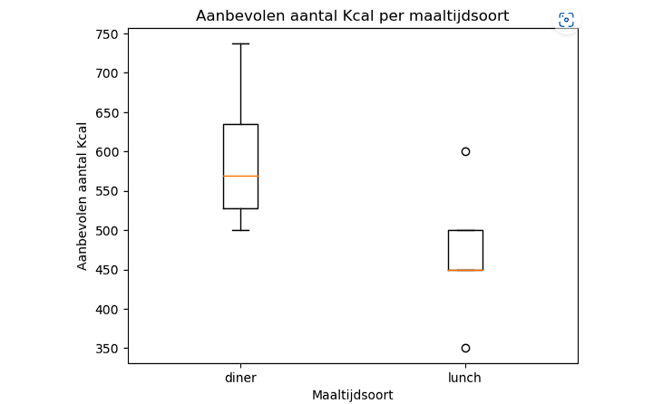
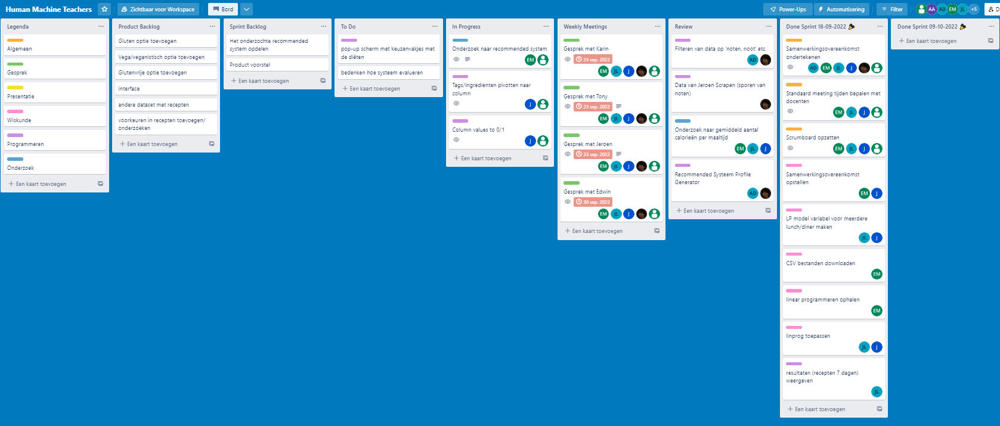

<h1>Portfolio Minor Applied Data Science</h1>

<h4>Student naam: Sefa Özmen</h4>

<h4>Student nummer: 19066791</h4>

<h4>Dit repository beschrijft mijn voortgang, bijdragen en reflectie van de Minor Applied Data Science 22-23</h4>

<h2>Datacamp + Reflection and evaluation</h2>

- [Datacamp](#Datacamp)
- [Personal Reflection](#Personal-Reflection)
- [Personal Learning Objectives](#Personal-Learning-Objectives)
- [Evaluation of the group project](#Evaluation-of-the-group-project)

<h2>Research project</h2>

- [Task Definition](#Task-Definition)
- [Evaluation](#Evaluation)
- [Conclusions](#Conclusions)
- [Planning](#Planning)

<h2>Predictive Analytics</h2>

- [Cofano](#Cofano-Predictive-Analytics)

<h2>Domain Knowledge</h2>

- [Introduction of the subject field](#Introduction-of-the-subject-field)
- [Literature Research](#Literature-Research)
- [Explanataion of Terminology, Jargon and Definitions](#Explanataion-of-Terminology-Jargon-and-Definitions)

<h2>Data preprocessing</h2>

- [Data Preprocessing](#Data-Preprocessing)
- [Exploring and explanation of the dataset](#Exploring-and-explanation-of-the-dataset)
- [Exploring and explanation of existing code](#Exploring-and-explanation-of-existing-code)
- [Visualization](#Visualization)

<h2>Communication</h2>

- [Presentations](#Presentations)
- [Paper](#Paper)

# Datacamp

- [Introduction to Python](https://github.com/sefaozmenn/applied-data-science/blob/main/datacamp/Introduction%20to%20Python.pdf)
- [Intermediate Python](https://github.com/sefaozmenn/applied-data-science/blob/main/datacamp/Intermediate%20Python.pdf)
- [Python Data Science Toolbox (Part 1)](https://github.com/sefaozmenn/applied-data-science/blob/main/datacamp/Python%20Data%20Science%20Toolbox%20(Part%201).pdf)
- [Python Data Science Toolbox (Part 2)](https://github.com/sefaozmenn/applied-data-science/blob/main/datacamp/Python%20Data%20Science%20Toolbox%20(Part%202).pdf)
- [Statistical Thinking In Python (Part 1)](https://github.com/sefaozmenn/applied-data-science/blob/main/datacamp/Statistical%20Thinking%20in%20Python%20(Part%201).pdf)
- [Machine Learning With Scikit-learn](https://github.com/sefaozmenn/applied-data-science/blob/main/datacamp/Machine%20Learning%20with%20scikit-learn.pdf)
- [Linear Classifiers In Python](https://github.com/sefaozmenn/applied-data-science/blob/main/datacamp/Linear%20Classifiers%20in%20Python.pdf)
- [Introduction to Data Visualization with Matplotlib](https://github.com/sefaozmenn/applied-data-science/blob/main/datacamp/Introduction%20to%20Data%20Visualization%20with%20Matplotlib.pdf)
- [Model Validation In Python](https://github.com/sefaozmenn/applied-data-science/blob/main/datacamp/Model%20Validation%20in%20Python.pdf)
- [Data Manipulation With pandas](https://github.com/sefaozmenn/applied-data-science/blob/main/datacamp/Data%20Manipulation%20with%20pandas.pdf)
- [Exploratory Data Analysis In Python](https://github.com/sefaozmenn/applied-data-science/blob/main/datacamp/Exploratory%20Data%20Analysis%20in%20Python.pdf)
- [Cleaning Data In Python](https://github.com/sefaozmenn/applied-data-science/blob/main/datacamp/Cleaning%20Data%20in%20Python.pdf)
- [Machine Learning For Timeseries Data In Python](https://github.com/sefaozmenn/applied-data-science/blob/main/datacamp/Machine%20Learning%20for%20Time%20Series%20Data%20in%20Python.pdf)
- [Manipulating Timeseries Data Python](https://github.com/sefaozmenn/applied-data-science/blob/main/datacamp/Manipulating%20Time%20Series%20Data%20in%20Python.pdf)
- [Joining Data with pandas](https://github.com/sefaozmenn/applied-data-science/blob/main/datacamp/Joining%20Data%20with%20pandas.pdf)
- [Time Series Analysis in Python](https://github.com/sefaozmenn/applied-data-science/blob/main/datacamp/Time%20Series%20Analysis%20in%20Python.pdf)
  
  
# Personal Reflection
In het begin van de minor werd er eerst een introductie lesgegeven over Data Science en de inhoud van de minor Applied Data Science. In deze les moest iedereen getallen geven om de groepen in te delen. Na dat iedereen random getallen had doorgegeven heeft meneer Vuurens een indeling weten te maken door een algoritme. Toen de groepen bekend werden was het even navragen om je groepsgenoten te vinden. Want deze minor wordt ook gevolgd door studenten van andere scholen.
Na het kennismaken met de groep hebben we kort overlegd over ieders sterke en zwakke punten. Dit hebben we vervolgens met elkaar besproken en doorgenomen. We hebben ook kort over onze hobby’s gehad. Dit zorgde ervoor om elkaar beter te leren kennen.
Elke groep moest net als ons als eerst beginnen met het Food boost project. In deze project heb ik vooral meegeholpen met het data preperation. Wij als groep wilden alle recepten met noten uitfilteren en ook het dataset draaien zodanig dat we per recept konden zien of het een ingrediënt bevat of niet. 
Voor het container project heb ik mezelf vooral gericht op Reinforcement Learning. Omdat nog niemand kennis had met Reinforcement Learning hebben we ervoor gekozen dat iedereen zijn eigen model ging maken. Ik heb hiervoor kennis opgedaan op het internet. Dit deed ik met behulp van YouTube filmpjes te volgen en dit na te doen. Op deze manier heb ik nuttige kennis leveren aan mijn groepje zodat zij overtuigende keuzes konden maken tijdens het maken van het laatste model. 

**STARR: Het leren van een LP-model**

**Situatie**

In onze food boost project had Eric, Jesse en Joanne heel snel een LP-model gemaakt. Alleen was dit natuurlijk lastig te begrijpen voor mij. Zij hadden hiermee al vaker gewerkt en voor mij was het de eerste keer.

**Taak**

Ik heb dus aan Jesse persoonlijk gevraagd of hij kan uitleggen wat een LP-model is en waarvoor het gebruikt wordt. En daarna ook hoe het LP-model van ons werkt binnen het food boost project.

**Actie**

We kwamen dus met het groepje bij elkaar op school en toen begon Jesse met het uitleggen van het LP-model. Ik ben iemand die algemeen praktischere dingen sneller snapt dan theoretische uitleg. Dus d.m.v. het vragen te stellen en actief op te letten kreeg ik steeds meer beeld van wat het LP-model is en wat het doet. 

**Resultaat**

Met het resultaat ben ik tevreden. Na het uitleg van Jesse snap ik dus wat een LP-model is en wat het doet. En natuurlijk is het nu ook voor mij duidelijk hoe onze eigen LP-model van het food boost project in elkaar zit. 

**Reflectie**

Ik denk persoonlijk dat het LP-model goed bijdraagt in de ontwikkeling van studenten. Het LP-model kan vaak van pas komen bij optimaliseringsproblemen. 

# Personal Learning Objectives
Ik stond helaas heel lang op de wachtlijst en zou bijna beginnen met een andere minor. Tot dat ik een week voor school werd gemaild dat ik was ingeschreven voor de minor Applied Data Science. Vervolgens heb ik mijzelf gelijk uitgeschreven van de minor Cloud Technology. Toen ik te horen kreeg dat ik mee mocht doen met deze minor heb ik direct wat research gedaan naar Data Science d.m.v. wat filmpjes te kijken op YouTube om te zien wat mij verwachten stond.
Voor dat deze minor begon was mijn verwachting om met deze minor mezelf de basisprincipes van data Science te leren. Het was vooral kennismaken met Machine Learning modellen en Python. Dit was allemaal voor mij de 1e keer dat ik hiermee heb gewerkt. Ik heb d.m.v. het maken van de Datacamp courses mezelf ontwikkelt in Python. Ik kan nu Python code schrijven, lezen en begrijpen wat het doet. Bij het container project heb ik mezelf ook verdiept in Reinforcement Learning. Nu snap ik hoe de AREA(Agent, Reward, Enviroment, Action) werkt. kennis heb ik dan ook toegepast in de projecten waarin ik heb gewerkt. Verder heb ik ook geleerd dat er binnen Machine Learning weer heel veel methodes inzitten. En dat je de juiste methode moet gaan kiezen om je behoeftes te vervullen. 
Verder heb ik ook kennisgemaakt met Lineaire Programmeren. Dit is dan iets waarbij andere studenten van uit het studie Wiskunde al veel van wisten vergeleken met de IT’ers. In begin vond ik het lastig te begrijpen. Na mate ik steeds vragen ging stellen aan mijn groepsgenoten en na de les van mevrouw Karin begon ik steeds meer het begrijpen van het model. Nu snap ik hoe ons LP-model binnen het Food boost project werkt. 

**STARR: Het leren van Reinforcement Learning**

**Situatie**

We hadden dus met de groep gekozen om elk groepslid een eigen Reinforcement model te gaan maken met ieder zijn eigen methode. We hadden hiervoor gekozen zodat iedereen een Reinforcement model kon maken, trainen en begrijpen wat er gebeurt. Het allerbelangrijkste is dat iedereen er iets van leert binnen de groep. En natuurlijk dat iedereen een bijdrage levert aan het Cofano project. 

**Taak**

Elk groepslid kreeg dus de opdracht om een Reinforcement model te gaan maken. Ik ging op Youtube opzoek naar tutorials over Reinforcement Learning. Na het rondbekijken van video’s heb ik uiteindelijk een goede video gevonden over een man genaamd Nicholas Renotte die in 3 uurtjes uitlegt hoe je een model maakt met Python in Jupyter Notebook.

**Actie**

Ik heb de volle 3 uur durende tutorial op Youtube gekeken. Terwijl ik dit aan het doen was ik ook bezig om de opdracht ook zelf uit te voeren op onze Jupyter Notebook. Een paar keer kreeg ik foutmeldingen binnen Jupyter Notebook. Wat ik vervolgens deed was het zoeken naar antwoorden op mijn foutmeldingen binnen de reacties van deze Tutorial. Hier vond ik allemaal gepaste antwoorden zodanig om mij model weer werkend te krijgen. 

**Resultaat**

Het resultaat van mijn acties is een model voor een cartpole model waarbij ik gebruik maak van de stablebaselines 3 library en de PPO-algoritme. Mijn model bereikt ook de maximum reward van 200 die ik als threshold heb neergezet.

**Reflectie**

Ik ben heel blij dat ik deze tutorial heb gevolgd. Mede dankzij deze tutorial heb ik kennisgemaakt met Reinforcement Learning. Deze tutorial heeft mij kennis en ervaring opgeleverd. En natuurlijk ook ervoor gezorgd dat ik mijn groep waardevolle informatie kon geven over dit model. Wat ik nog wel zou willen doen is deze model te proberen in mijn eigen environment.

# Evaluation of the group project
Ik vond mijn groep een heel leuk projectgroep waaraan ik mee mocht doen. In begin van projecten is het altijd wel een beetje lastig om met elkaar om te gaan, omdat we elkaar nog helemaal niet kennen. Eric, Jesse en Joanne kenden elkaar al en zitten in dezelfde opleiding. Ayrton komt vanuit een luchtvaartechniek opleiding en Martti doet Computer Networks in Delft. Ik studeer dan weer Business & Data Management in Den Haag. 
We hebben met het groep besloten om 3x per week fysiek bij elkaar te komen en te vergaderen. Dit was op de maandag/woensdag/vrijdag. Soms kon er een van ons niet bijzijn en dan kon je achteraf alsnog de notulen van de vergadering lezen die Eric altijd netjes schreef en in Teams ging uploaden.  Op de dinsdag en donderdag hadden we geen vergaderingen, maar kon je dus wel werken aan je taken. Omdat dit mijn 1e kennismaking was met Python had ik een achterstand vergeleken met mijn groepsgenoten. Zij hadden al ooit met Python gewerkt en hadden dus al wat ervaring. 
Omdat ik dus een achterstand had heb ik zelf niet evenveel gecodeerd als mijn andere groepsgenoten. Ik ging dus vooral vaak logisch meedenken met Joanne en Martti om van nut te zijn. Hierbij ging ik problemen oplossen door logica te gebruiken en Google goed te gebruiken. Ik wist vaak dus wat er moest gebeuren alleen had ik de benodigde kennis niet om het te beschrijven in Python. Ik vertelde dus mijn ideeën aan Joanne & Martti zodat zij dit vervolgens kunnen coderen.

**STARR: Het opzetten van een SCRUM board**

**Situatie**

We kregen te horen dat we les van meneer T.A. over SCRUM zouden krijgen. Dus we besloten ook met de groep om SCRUM te gebruiken.

**Taak**

In de groep was ik de meest ervaren persoon die het vaakst met SCRUM heeft gewerkt. Dus nam ik de verantwoordelijk om een SCRUM board op te zetten. 

**Actie**

Ik stelde voor aan mijn groepsgenoten om met Trello te gaan werken, omdat dit een gratis en intuïtief tool is om mee te werken. Vervolgens gaf ik ook een klein tutorial over hoe je overweg kan met het tool.

**Resultaat**

Het resultaat is dat iedereen heeft geleerd om met SCRUM te werken. 

**Reflectie**

Ik ben blij dat ik mijn ervaringen/kennis over SCRUM heb kunnen bijdragen aan de groep. Ik hoop hiermee dat iedereen voorbereid is op projecten waarbij SCRUM wordt toegepast.

# Task Definition

Tegenwoordig letten mensen steeds meer op wat ze eten. Dit zie je terug in verschillende diëten zoals vegetarische en veganistische diëten. Soms is het gemakkelijk om erachter te komen welk dieet het beste is voor iemand, maar vaak is het een lastige taak. Het doel van het food boost project is om een aanbevelingssysteem te creëren dat voorspelt of iemand een bepaald recept lekker zal vinden, geïmplementeerd in een dieet dat gemakkelijk te maken en vol te houden is. In dit project hebben mijn team en ik ons gericht op de basis van het voorspellende deel van het project en hoe de voorspelde gerechten in iemands dieet kunnen worden verwerkt, rekening houdend met notenallergieën. 

We hebben de volgende onderzoeksvragen gedefinieerd: 

Met welke methode kunnen we een wekelijkse lunch- en dineraanbeveling maken, rekening houdend met een notenallergie en rekening te houden met een gecombineerde gemiddelde hoeveelheid calorieën voor lunch en diner samen?

1.	Welk gerecht kan worden beschouwd als een notenallergeen?
2.	Wat is een gemiddelde hoeveelheid calorieën voor lunch en diner samen?
3.	Welke methode wordt/kan gebruikt worden om te voorspellen of iemand een lunch of diner lekker vindt?
4.	Welke methode kan gebruikt worden om een voedingsschema te maken met zoveel mogelijk variatie?

# Evaluation

Ik denk dat we al een redelijk model hebben gemaakt die een goed basis vormt voor mensen die een notenallergie hebben. Als iemand dit verder zal gaan met dit project zijn er nog zeker veel manieren/ideeën waaraan het model verbeterd kan worden.

Het is natuurlijk ook beter als je dit model uitwerkt met andere soorten allergieën. Nu is het alleen bedoeld voor mensen die een notenallergie hebben, omdat we alle recepten met ingrediënten waar noten inzitten uitgefilterd hebben. Je kan het bijvoorbeeld doen met mensen die een allergie hebben voor pinda’s of eieren. Uiteindelijk kan je dan alle datasets samenvoegen en dan dit realiseren in een applicatie. En dan kan de gebruiker in de applicatie aangeven welke allergie die heeft. Vervolgens pakt de applicatie dan de juiste dataset.

Het is ook mogelijk om het model uit te breiden. Hiermee bedoel ik dat je niet alleen lunch en diner meeneemt, omdat je meerdere keren op een dag eet. Je zou bijvoorbeeld het ontbijt hiermee ook kunnen meenemen. En als je het nog uitgebreider wilt kan je ook de tussendoortjes hierin meenemen. 

# Conclusions

**Welk gerecht kan worden beschouwd als een notenallergeen?** 

Een van de eerste dingen die we deden, was op internet zoeken naar een lijst of tabel met verschillende ingrediënten die als notenallergenen worden beschouwd. Omdat we verschillende ingrediënten vonden die noten bevatten, hebben we uiteindelijk verschillende soorten noten op een rij gezet en eruit gefilterd. 
We hebben ook een falsePositives-lijst gemaakt waarin we verschillende soorten ingrediënten opsommen die geen enkele soort noten bevatten, maar wel noten in het woord zelf bevatten (bijv. nootmuskaat). Met deze lijst in de hand hebben we elk recept in de Allerhande-dataset bekeken en gecontroleerd of de ingrediënten iets bevatten dat als notenallergeen kan worden beschouwd.

**Wat is een gemiddelde hoeveelheid calorieën voor lunch en diner samen?**

Ons onderzoek concludeerde dat de gemiddelde inname voor lunch en diner 1040 kcal per dag is. Het gemiddelde diner is ongeveer 575 kcal en de gemiddelde lunch 465 kcal. Dit is te zien in de onderstaande boxplot.

Boxplot

**Welke methode wordt/kan gebruikt worden om te voorspellen of iemand een lunch of diner lekker vindt?**

Voor ons project hebben we een algoritme voor een Decision Tree getraind op een dataset van receptingrediënten die gebruikers wel en niet lekker vinden. Met deze data kan een Decision Tree voorspellen of een gebruiker een recept lekker vindt.

**Welke methode kan gebruikt worden om een voedingsschema te maken met zoveel mogelijk variatie?**

Om zoveel mogelijk gevarieerde voerschema's te creëren, hebben we een lineair programmeermodel gebruikt. Het model gebruikt restricties om te voorkomen dat gebruikers elke dag hetzelfde recept krijgen en om het totale aantal calorieën voor diner en lunch onder de 1040 te houden. Het model mocht slechts één lunch- en één dinerrecept per dag kiezen.

# Planning

In het begin had ik een SCRUM board via Trello opgezet voor ons team om met SCRUM aan het werk te gaan. Tot ongeveer week 10 liep goed en hielden we Trello echt goed bij en we bespraken ook altijd bij de meetings over de sprints en de taken die in Trello stonden. Na week 10 was het langzamerhand minder geworden, omdat we dus meer tijd gingen insteken in taken i.p.v. aan de planning. 

Trello

# Cofano Predictive Analytics

# Introduction of the subject field

Het foodboost project past data science toe op eindgebruikers. In ons project gaat dit dan over gebruikers met dieetwensen, omdat wij ons project hebben toegepast op notenallergenen. Het is belangrijk om te weten welk recept noteningrediënten bevat en uit de dataset is gefilterd. Het kan anders heel makkelijk fataal gaan als iemand allergisch is voor noten. 

Het containerproject past data science toe op logistiek transport. Het project is gebaseerd op het sorteren van containers in een kade en het effectief en efficiënt creëren van een lay-out om de tijd die nodig is om de containers te lossen te verminderen. Dit proces moet efficiënt verlopen, want anders kost dit het bedrijf veel geld.

# Literature Research

Ik heb de volgende bronnen gebruikt om kennis op te doen:

- [Python](https://www.datacamp.com/)
- [Linear Programming](https://www.youtube.com/watch?v=0TD9EQcheZM)
- [Linear Programming](https://math.mit.edu/~goemans/18310S15/lpnotes310.pdf)
- [Reinforcement Learning](https://www.youtube.com/watch?v=Mut_u40Sqz4&t=5659s)
- [Reinforcement Learning](https://www.youtube.com/watch?v=JgvyzIkgxF0&t=816s)

# Explanataion of Terminology, Jargon and Definitions

In het project zijn er enkele termen en jargon die misschien uitgelegd moeten worden:

- Reinforcement learning: is een gebied van machine learning dat zich bezighoudt met de vraag hoe intelligente agenten acties in een omgeving moeten ondernemen om de notie van cumulatieve beloning te maximaliseren. Versterkingsleren is een van de drie basisparadigma's voor machinaal leren, naast leren onder toezicht en leren zonder toezicht.
- Lineaire programmering: is een speciaal geval van wiskundige programmering. Het wordt ook wel wiskundige optimalisatie genoemd.
- Lay-out: de locatie waar de containers staan.
- Decision Tree: wordt gebruikt voor zowel classificatie- als regressietaken.
- falsePositives-lijst: een lijst van ingredienten die het woord noot bevatten, maar eigenlijk zit er geen noot in. bijvoorbeeld nootmuskaat
- Scrum: is een agile kader voor projectbeheer dat teams helpt hun werk te structureren en te beheren door middel van een reeks waarden, beginselen en werkwijzen.

# Data Preprocessing
Hier zal ik de data preprocessing van de data behandelen voor de FoodBoost project waaraan ik heb gewerkt.
# Exploring and explanation of the dataset
# Exploring and explanation of existing code
# Visualization

# Presentations
- [Presentatie week 4 (Foodboost)](https://github.com/sefaozmenn/applied-data-science/blob/main/presentaties/Voortgang%20food%20project%20week%204.pptx)
- [Presentatie week 6 (Foodboost)](https://github.com/sefaozmenn/applied-data-science/blob/main/presentaties/food%20project%20week%206.pptx)
- [Presentatie week 8 (Cofano)](https://github.com/sefaozmenn/applied-data-science/blob/main/presentaties/container%20-%20week%208.pptx)
- [Presentatie week 16 (Cofano)](https://github.com/sefaozmenn/applied-data-science/blob/main/presentaties/container%20-%20week%2016.pptx)

# Paper

Om te beginnen met het schrijven van de paper, vroeg ik de groep of ik de eindverantwoordelijke van de paper mocht zijn. Dit vroeg ik, omdat ik vaker eindverantwoordelijke van rapporten zoals een adviesrapport ben geweest in projecten. Ik vind het leuk en leerzaam om eindverantwoordelijk te zijn van een paper. Het is heel belangrijk dat iemand aangesteld wordt als eindverantwoordelijke van de paper. Anders komt straks de paper niet overeen of vergeten we punten in de paper.
Toen we dit besloten hadden zijn we verdergegaan met de taakverdeling van de paper. Ik kreeg de taak om de toekomstig werk te beschrijven. Hiervoor ging ik met mijn team in gesprek en kijken wat we konden verzinnen als toekomstig werk. Hiervan heb ik aantekeningen gemaakt en ik heb ze netjes in de paper verwerkt.  
